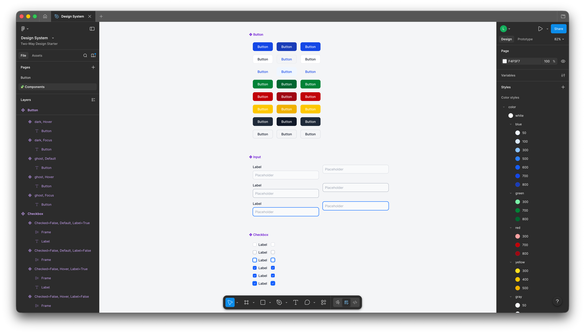
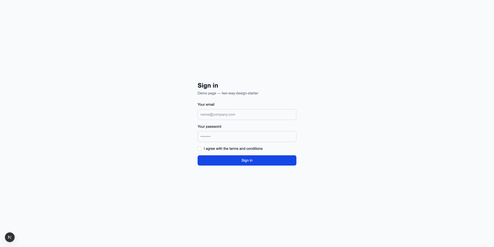
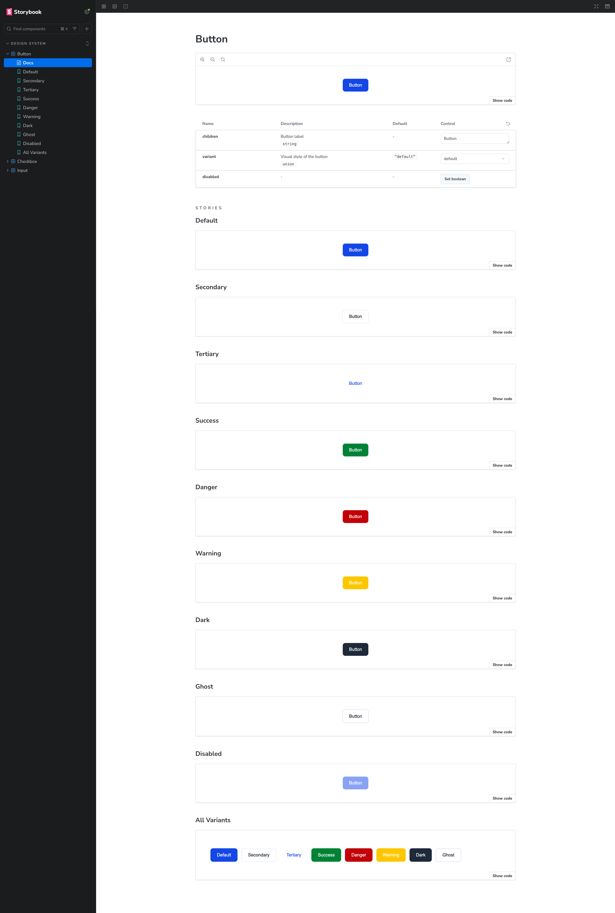

# two-way-design-starter

An experiment in **bidirectional design system sync** between Figma and code, built entirely with Claude Code. No manual coding.

> Full experiment report → [`docs/experiment-report.md`](./docs/experiment-report.md) · Origin prompt → [`docs/genesis.md`](./docs/genesis.md)



---

## What this is

A minimal starter that shows how a small design system can stay in sync between Figma and your codebase in both directions, using Claude Code slash commands as the sync agent.

The repo includes a Figma plugin that generates all component sets programmatically, a Next.js demo page, and a Storybook. All seeded from the same design tokens.

→ [Read the full experiment report](./docs/experiment-report.md) · [How this was built](./docs/genesis.md)

---

## Stack

| Layer      | Tool                    |
| ---------- | ----------------------- |
| Framework  | Next.js 16 (App Router) |
| Language   | TypeScript              |
| Styling    | Tailwind CSS v4         |
| Components | Custom (no UI library)  |
| Storybook  | v10                     |
| Sync agent | Claude Code             |

---

## 1. Clone and run

```bash
git clone https://github.com/lucaslarroche/two-way-design-starter.git
cd two-way-design-starter
npm install
npm run tokens:build    # generate CSS variables from tokens.json
npm run dev             # http://localhost:3000
npm run storybook       # http://localhost:6006
```



---

## 2. Figma setup

**Create a Figma file and get your credentials:**

1. Create a new Figma file
2. Copy the file ID from the URL: `figma.com/design/**FILE_ID**/your-file-name`
3. Go to [figma.com/settings](https://www.figma.com/settings) → **Security** → **Personal access tokens** → **Generate new token**
4. Enable at minimum: `file_content:read`, `file_metadata:read`, `library_assets:read`
5. Copy `.env.example` to `.env.local` and fill in your credentials:

```bash
cp .env.example .env.local
```

```
FIGMA_TOKEN=your_personal_access_token
FIGMA_FILE_ID=your_file_id
```

---

## 3. Run the Figma plugin

The plugin generates all color styles and component sets (Button, Input, Checkbox) directly in your Figma file.

1. In Figma, go to **Plugins → Development → Import plugin from manifest**
2. Point it at `figma-plugin/manifest.json` in this repo
3. Run the plugin — it creates all color styles and component sets on a `🧩 Components` page
4. **Publish the styles**: Main menu → Libraries → Publish changes


---

## 4. Figma → Code: sync a color change from Figma

When a designer changes a color style in Figma:

1. Edit a color style in Figma (e.g. open `color/blue/700` and change the value)
2. **Publish** the updated styles (Main menu → Libraries → Publish)
3. In Claude Code, run:

```
/sync-figma-to-code
```

Claude will pull the updated styles, show you a diff, and rebuild the CSS variables after your approval.

---

## 5. Code → Figma: sync a color change from code

When a developer changes a color in the codebase:

1. Edit a CSS variable in `src/app/_theme.css` (between `/* tokens:start */` and `/* tokens:end */`)
2. In Claude Code, run:

```
/sync-code-to-figma
```

Claude will detect the change, update `tokens.json`, rebuild the Figma plugin palette, and ask you to re-run the plugin in Figma to apply the update.

---

## Components

| Component  | Variants                                                            |
| ---------- | ------------------------------------------------------------------- |
| `Button`   | default, secondary, tertiary, success, danger, warning, dark, ghost |
| `Input`    | one size, optional label                                            |
| `Checkbox` | one size, optional label                                            |



---

## Scripts

| Script                  | What it does                                              |
| ----------------------- | --------------------------------------------------------- |
| `npm run dev`           | Start Next.js dev server                                  |
| `npm run storybook`     | Start Storybook                                           |
| `npm run tokens:build`  | Regenerate CSS variables from tokens.json                 |
| `npm run plugin:build`  | Regenerate RGB palette in figma-plugin/code.js            |
| `npm run figma:pull`    | CLI: Figma color styles → tokens.json (no AI)             |
| `npm run figma:push`    | CLI: rebuild plugin palette (then re-run plugin in Figma) |

---

## License

MIT. Fork it, break it, make it yours.
