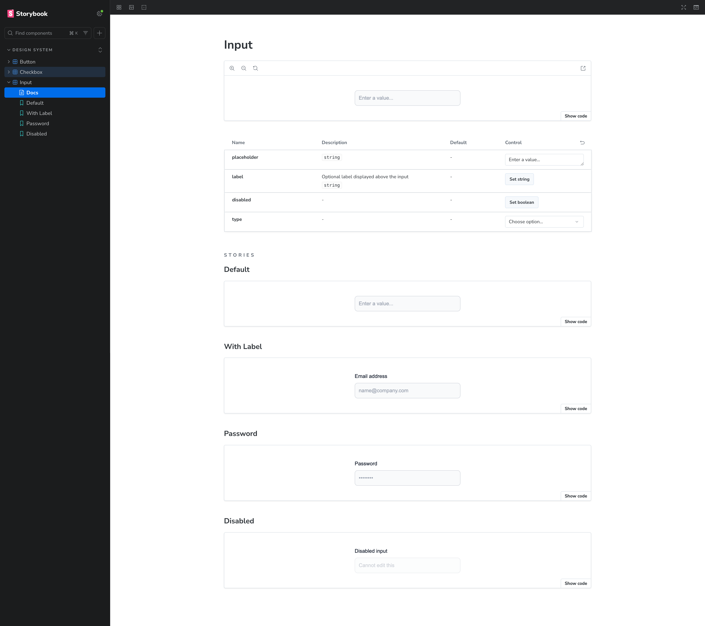
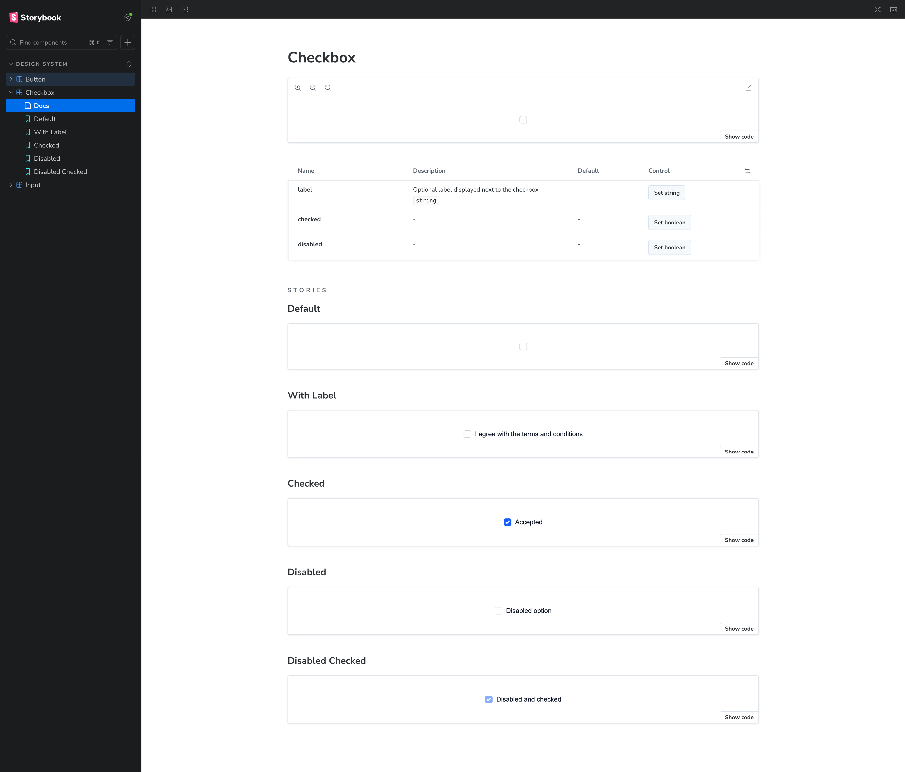

# Two-Way Design System Sync

### Figma and Code with Claude Code

_A no-code experiment, built entirely with Claude Code and Claude Cowork_

---

## Executive Summary

We set out to answer one question: can AI keep a Figma design system and a codebase in sync, automatically, in both directions?

The short answer is **yes, with caveats**.

We built a working proof of concept using Claude Code and Claude Cowork, without writing a single line of code by hand. The result is a Next.js + Tailwind design system with 3 components (Button, Input, Checkbox), a Figma file seeded by a custom plugin, and two Claude Code slash commands that sync color tokens between Figma and code.

The original plan relied on the **Figma MCP server** for direct AI-to-Figma communication. It hit real API limits: the MCP server cannot edit styles, the REST API cannot write variable values with a personal access token, and Figma still doesn't support `oklch()` colors. We worked around all of it, but each workaround added friction.

**What works today:** Figma to Code is fully automated (one command, shows a diff, rebuilds CSS). Code to Figma works but needs a manual plugin re-run as the last step.

**The takeaway:** even an imperfect AI sync is faster and less error-prone than doing it by hand. As the Figma API matures, the remaining rough edges go away.

---

## The Problem

Design systems live in two places at once: **Figma** (design source of truth) and **code** (implementation source of truth). Keeping them in sync is manual, slow, and error-prone.

- Designers update a color in Figma. Developers don't notice for days.
- Developers tweak a shade in CSS. Figma drifts out of date.
- Nobody owns the sync. The gap widens.

Can we close that gap with AI?

---

## The Opportunity

Claude Code can read and write files, run scripts, call APIs, and ask before making changes. That is exactly the shape of a sync agent.

The original plan was to use the **Figma MCP server**, a connector that lets Claude talk to Figma directly without scripts or REST calls. In theory: ask Claude to read a component, change a color, update a style. All in plain language.

In practice, the Figma MCP server hit a wall (see Limitations). But the core idea held:

- Read Figma, update code (one command)
- Read code, update Figma (one command)
- Always show a diff. Always ask before writing.
- No custom tooling beyond a few small scripts.

---

## What This Repo Demonstrates

- A **Next.js + Tailwind** app with 3 components (Button, Input, Checkbox)
- A **Storybook** documenting all variants
- A **Figma plugin** that generates all component sets with no manual Figma work
- A **token bridge** (`tokens.json`) between Figma color styles and CSS variables
- Two **Claude Code slash commands** that sync color tokens in both directions


---

## Stack

| Layer      | Tool                    | Why                                   |
| ---------- | ----------------------- | ------------------------------------- |
| Framework  | Next.js 16 (App Router) | Most common React setup               |
| Language   | TypeScript              | Type safety for tokens and components |
| Styling    | Tailwind CSS v4         | CSS variables as first-class citizens |
| Components | Custom                  | No UI library dependency              |
| Storybook  | v10                     | Visual component documentation        |
| Sync agent | Claude Code             | AI agent with file and API access     |
| Figma      | Plugin API + REST API   | Component generation and style read   |

---

## Repo Structure

```
two-way-design-starter/
├── .claude/commands/
│   ├── sync-figma-to-code.md    ← slash command: Figma → code
│   └── sync-code-to-figma.md    ← slash command: code → Figma
├── figma-plugin/
│   ├── manifest.json
│   └── code.js                  ← generates styles + components in Figma
├── scripts/
│   ├── build-tokens.ts          ← tokens.json → CSS variables
│   ├── build-plugin.ts          ← tokens.json → RGB palette in code.js
│   ├── figma-to-tokens.ts       ← Figma REST API → tokens.json
│   └── tokens-to-figma.ts       ← rebuilds plugin palette
├── src/
│   ├── app/
│   │   ├── page.tsx             ← login form demo
│   │   └── _theme.css           ← CSS variables (tokens:start / tokens:end)
│   ├── components/
│   │   ├── Button/
│   │   ├── Input/
│   │   └── Checkbox/
│   └── tokens/tokens.json       ← single source of truth
└── CLAUDE.md                    ← project context for Claude
```

---

## How It Was Built

This repo was built entirely with Claude Code and Claude Cowork. No manual coding.

The starting point was a single prompt in `docs/genesis.md`. From there:

- Claude scaffolded the Next.js project, Tailwind config, and all 3 components
- Claude wrote the Figma plugin to generate component sets
- Claude wrote the sync scripts and slash commands
- Every iteration, bug fix, and architectural decision happened in conversation

---

## Setup: 5 Steps

**1. Clone and install**

```bash
git clone https://github.com/lucaslarroche/two-way-design-starter.git
cd two-way-design-starter
npm install && npm run tokens:build
```

**2. Create a Figma file and get a personal access token**
Enable scopes: `file_content:read`, `file_metadata:read`, `library_assets:read`

**3. Set credentials**

```bash
cp .env.example .env.local
# fill in FIGMA_TOKEN and FIGMA_FILE_ID
```

**4. Run the Figma plugin**
Plugins → Development → Import from manifest → `figma-plugin/manifest.json` → Run

**5. Publish Figma styles**
Main menu → Libraries → Publish changes

---

## The Token Bridge

`src/tokens/tokens.json` is the single source of truth: a map of hex colors keyed by family and shade.

```json
{
  "color": {
    "blue": {
      "700": "#1447e6"
    }
  }
}
```

The same value appears in five forms across the stack:

| Where       | Format           | Example                         |
| ----------- | ---------------- | ------------------------------- |
| tokens.json | Nested JSON      | `color.blue.700`                |
| \_theme.css | CSS variable     | `--color-blue-700`              |
| Tailwind    | Utility class    | `bg-blue-700`                   |
| Figma       | Color style name | `color/blue/700`                |
| Plugin      | RGB float        | `{ r: 0.08, g: 0.28, b: 0.90 }` |

---

## How the Sync Works

### Figma to Code

```
Figma color styles
       ↓  REST API (figma-to-tokens.ts)
  tokens.json
       ↓  npm run tokens:build
   _theme.css  →  Tailwind CSS  →  components
```

### Code to Figma

```
_theme.css (edited)
       ↓  sync command detects diff
  tokens.json  (updated)
       ↓  npm run plugin:build
  figma-plugin/code.js  (RGB palette regenerated)
       ↓  re-run plugin in Figma
  Figma color styles  (updated)
```

---

## Workflow 1: Change a Color in Figma, Sync to Code

**In Figma:**

1. Open the `color/blue/700` style and change it
2. Main menu → Libraries → Publish

**In Claude Code:**

```
/sync-figma-to-code
```

Claude fetches the updated styles, shows a diff, asks for approval, then rebuilds the CSS:

```
CHANGED
  color.blue.700: #1447e6 → #9333ea
```

Run `npm run dev` to see the change live.

---

## Workflow 2: Change a Color in Code, Sync to Figma

**In the codebase:**
Edit `--color-blue-700` in `src/app/_theme.css`. Hot reload shows the change in the browser right away.

**In Claude Code:**

```
/sync-code-to-figma
```

Claude detects the diff, asks for approval, updates `tokens.json`, rebuilds `code.js`, then asks you to re-run the plugin in Figma. The color style updates and all components refresh.

---

## The Components


**Button** — 8 variants × 3 states = 24 components
Default, Secondary, Tertiary, Success, Danger, Warning, Dark, Ghost



**Input** — optional label, 3 states (default, hover, focus)



**Checkbox** — checked/unchecked, optional label, 3 states

---

## The Demo Page


A minimal login form using all three components. Change a color anywhere in the chain and it flows through to everything.

---

## Limitations

As of March 2026, several Figma limits shaped how this was built:

**Figma MCP server:**

- Cannot create or edit components
- Can create styles but not edit their fill values
- Docs say it supports reading and writing variables, but the `file_variables:read` scope is not available for personal access tokens, even on a paid Professional plan

**Figma REST API:**

- `PUT /styles/:key` does not update fill colors (returns 404)
- The Variables API requires OAuth 2.0, not personal access tokens

**Figma color format:**

- Figma does not support `oklch()`, which is the default in Tailwind CSS v4
- Everything falls back to hex values

**Workarounds:**

- Built a custom Figma plugin to generate styles and components
- Code to Figma uses plugin rebuild + manual re-run instead of a REST push
- Hex values used throughout

---

## What Works Well

- **Figma to Code** is fully automated: one command, shows a diff, rebuilds CSS
- **Live feedback loop**: edit `_theme.css`, see changes in the browser instantly
- **Plugin as a seeder**: run once to scaffold the entire Figma file
- **CLAUDE.md as memory**: Claude always knows the architecture and rules
- **Slash commands**: the sync interface is two words

---

## What Could Be Better

- Code to Figma should be fully automated. Today it needs a manual plugin re-run.
- Once Figma enables `file_variables:read` for personal access tokens, variables can replace styles and push becomes a direct REST call
- Tokens could be extended beyond colors: spacing, typography, radius, shadows

---

## Conclusion

We started with a simple goal: fully automated, two-way sync between Figma and code. We didn't get all the way there. The Figma MCP server couldn't edit styles. The REST API couldn't write variable values. Code to Figma still needs a manual plugin re-run.

The pipeline is not perfect, but it works. The entire repo, plugin, scripts, and sync commands were built without writing a single line of code by hand.

The Figma limitations are real but temporary. The `file_variables:write` scope will eventually be available for personal access tokens. When it is, the last manual step goes away.

As of March 2026, this is as far as the tooling allows.

---

_Built with Claude Code and Claude Cowork — March 2026_
_[github.com/lucaslarroche/two-way-design-starter](https://github.com/lucaslarroche/two-way-design-starter)_
